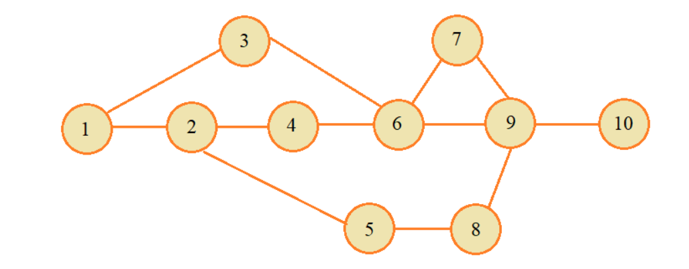
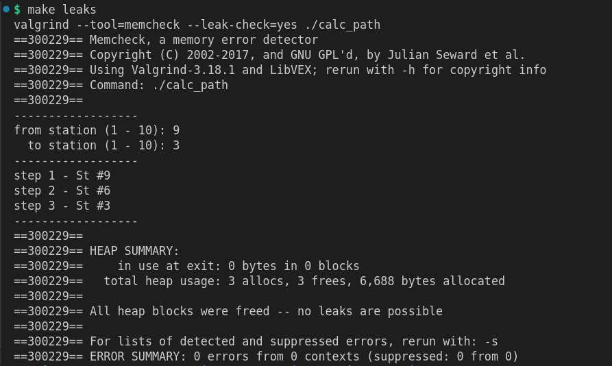

### Задание из курса С. Балакирева по базе C/C++

https://stepik.org/course/193691/info (🔥)

Программа для поиска кратчайшего маршрута от одной станции до другой.



В своей реализации использовал волновой алгоритм. Здесь хорошее объяснение:  

https://www.youtube.com/watch?v=9ev9Y-hJhj4

 🎯 как запустить (компилятор **gcc**): 

```shell
make
```

🧪 Все основные функции покрыты тестами: 

```shell
make test
```

💩 Проверка на утечки:

```shell
make leaks
```



🔥 Их нет! ٩(｡•́‿•̀｡)۶

